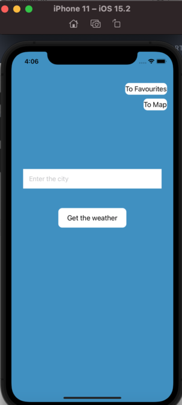
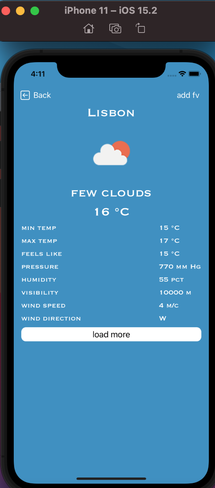
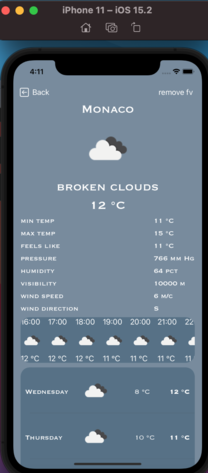
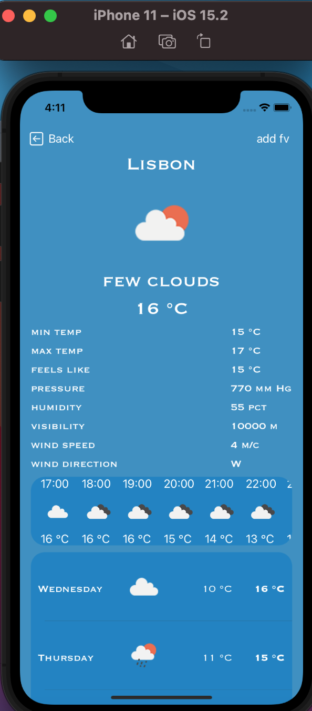

# Weather App

_Structure of the project_:
* City entry screen
* Screen with detailed weather information, weather by day and hour
* Screen with selected cities
* Map screen

## Project Description
With this application, you can find out the weather anywhere in the world. For your convenience, cities that you often enter can be added to your favorites list and quickly find out the weather in them. You can also find out the weather not only using the search bar, but also using the map, for this you need to click on the point you are interested in. Selected cities are marked on the map with markers, and your current location is marked with a custom marker.

The application supports two languages - English and Russian.
___
### Start screen

This is the first screen that is displayed when the application is loaded. From it, we can go to the screens with the selected cities and the map using the buttons in the upper right corner. We can go to the screen with detailed weather information by entering the name of the city and click on the "Get weather" button.
If the city is entered incorrectly and the application could not get the data, the application shows an alert with an error. Similarly, we will see an alert with an error if the field for entering the city is empty.

##### _code_
When writing the code for this screen, the __MVC__ architecture from Apple and the __SOLID__ principles were used.
To get the data, used https://openweathermap.org/api and the __network layer__ is written to get data on the name of the city, and request data in the metric system.
To improve the appearance of the code when creating the UI, the __Then library is used__
The __SnapKit library is used for layout__
___
### Detailed weather screen

On this screen we can see detailed information about the weather, when you click on the "Download more" button, another request is made and we receive data about the hourly and daytime weather. You can also add a city to favorites on this screen (or delete it if the city is already in favorites).

Depending on the weather, the color of the screen changes. Below are examples for good and bad weather
 

##### _code_
When writing the code for this screen, the __MVC__ architecture from Apple and the __SOLID__ principles were used.
To get data for hourly and daytime weather, used https://openweathermap.org/api and the __network layer__ is written to receive data by name coordinates, and request data in the metric system
To improve the appearance of the code when creating the UI, the __Then library is used__
The __SnapKit library is used for layout__
The __Kingfisher library is used to download and cache images.__
To add to the database, use __Realm__
___
### Screen with selected cities
This screen stores the selected cities that the user has added to the database. By swiping a city, you can delete a city from your favorites
Depending on the weather in the city, the color of the cell changes. Below are examples for good and bad weather

##### _code_
When writing the code for this screen, the __MVP__ architecture from Apple and the __SOLID__ principles were used.
__MVP__ is used to reduce code connectivity, interaction between modules occurs through __protocols__.
To improve the appearance of the code when creating the UI, the __Then__ library is used
The __SnapKit__ library is used for layout
To add to the database, use __Realm__
___
### Map screen

##### _code_
__Google Maps__ used on this screen 
When writing the code for this screen, the __MVP__ architecture from Apple and the __SOLID__ principles were used.
__MVP__ is used to reduce code connectivity, interaction between modules occurs through __protocols__.
To improve the appearance of the code when creating the UI, the __Then library is used__
The __SnapKit library is used for layout__
